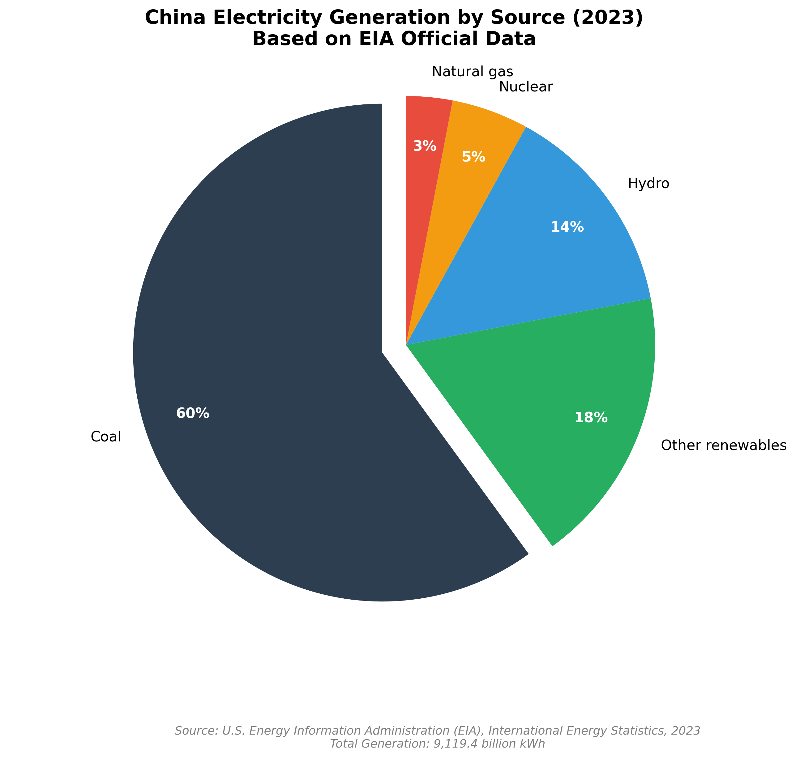

# Coal Industry Demand Analysis

*China Shenhua Energy | Industry Research*

---

## 1. Main Demand Sources

Coal demand in China mainly comes from:

- **Power generation** (largest and most stable downstream)
- **Steel industry**
- **Chemical industry**

### Coal's Dominant Position in China's Energy Mix

The following chart demonstrates coal's critical role in China's electricity generation structure, highlighting why power generation represents the most stable and significant demand source for coal companies like China Shenhua.

*Figure 1: China Electricity Generation by Source (2023) - Coal maintains its dominant position at 60% of total generation, demonstrating its critical role as base-load energy despite rapid renewable expansion. Source: EIA International Energy Statistics.*

Among these, power generation is the dominant and most stable demand source.  
It accounts for approximately **60% of total electricity generation in 2023** ([EIA Official Data](https://www.eia.gov/international/content/analysis/countries_long/China/?utm_source=chatgpt.com)).

---

## 2. Why Power Demand Is Stable

Electricity demand is **non-discretionary and cannot be interrupted**.  

Although renewable energy capacity has expanded rapidly, **wind and solar power are inherently intermittent**, requiring stable base-load energy sources. Coal-fired power remains the most reliable base-load option in China.  

This explains why coal demand, despite overall structural shifts toward renewables, **remains stable and predictable** for leading companies like China Shenhua.

---

## 3. Data Highlights (2023–2025)

| Metric                         | 2023  | 2024  | 2025 (Forecast / Preliminary) | Source |
|---------------------------------|-------|-------|-------------------------------|--------|
| Total Installed Capacity (GW)   | 3,200 | 3,400 | 3,600                         | [EIA](https://www.eia.gov/international/content/analysis/countries_long/China/?utm_source=chatgpt.com) |
| Coal Power Share (Installed Capacity) | 35%  | 34%   | 34%                           | [AsianFin](https://www.asianfin.com/news/171811?utm_source=chatgpt.com) |
| Renewables Share (Installed Capacity) | 55%  | 56%   | 60%                           | [NEA](https://www.spglobal.com/energy/en/news-research/latest-news/energy-transition/022725-china-aims-for-60-non-fossil-fuel-power-capacity-in-2025?utm_source=chatgpt.com) |
| Total Electricity Generation (TWh) | 9,300 | —     | —                             | [EIA](https://www.eia.gov/international/content/analysis/countries_long/China/?utm_source=chatgpt.com) |
| Coal-fired Electricity (%)      | 59.3% | —     | —                             | [SPGlobal](https://www.spglobal.com/commodity-insights/en/news-research/latest-news/energy-transition/013124-coal-still-accounted-for-nearly-60-of-chinas-electricity-supply-in-2023-cec?utm_source=chatgpt.com) |

---

## 4. Implications for the Coal Industry

- Coal demand in China is **system-driven, not growth-driven**.  
- For leading companies like China Shenhua, this creates a **relatively stable demand floor**.  
- Even as renewables expand, **coal-fired power remains essential** to stabilize the grid.  
- The industry exhibits **low collapse risk but limited growth**, making it suitable for companies focusing on **cash flow stability rather than growth narratives**.

---

## 5. Suggested Graphs / Figures

1. **Installed Capacity by Source (2023–2025)**  
     

2. **Electricity Generation by Source (2023)**  
     

3. **2025 New Capacity Additions**  
     

> ⚠ Note: Replace placeholders with Python-generated charts using `matplotlib` or `seaborn`.

---

## 6. Key Takeaways

- Power generation is the **core and stable demand driver** for coal.  
- Coal remains **critical for grid stability**, despite growth in renewables.  
- Leading integrated companies benefit from **stable earnings, predictable cash flows, and low downside risk**.  
- Understanding **installed capacity vs actual generation** is key for evaluating industry dynamics.

---

## 7. Data Sources

- U.S. Energy Information Administration (EIA) – China Country Analysis Brief 2025 ([link](https://www.eia.gov/international/content/analysis/countries_long/China/?utm_source=chatgpt.com))  
- National Energy Administration (NEA) – 2024 Renewable Installed Capacity ([link](https://www.spglobal.com/energy/en/news-research/latest-news/energy-transition/022725-china-aims-for-60-non-fossil-fuel-power-capacity-in-2025?utm_source=chatgpt.com))  
- China Electricity Council (CEC) – Coal Share of Electricity Supply 2023 ([link](https://www.spglobal.com/commodity-insights/en/news-research/latest-news/energy-transition/013124-coal-still-accounted-for-nearly-60-of-chinas-electricity-supply-in-2023-cec?utm_source=chatgpt.com))  
- AsianFin – 2025 Preliminary Installed Capacity Figures ([link](https://www.asianfin.com/news/171811?utm_source=chatgpt.com))
